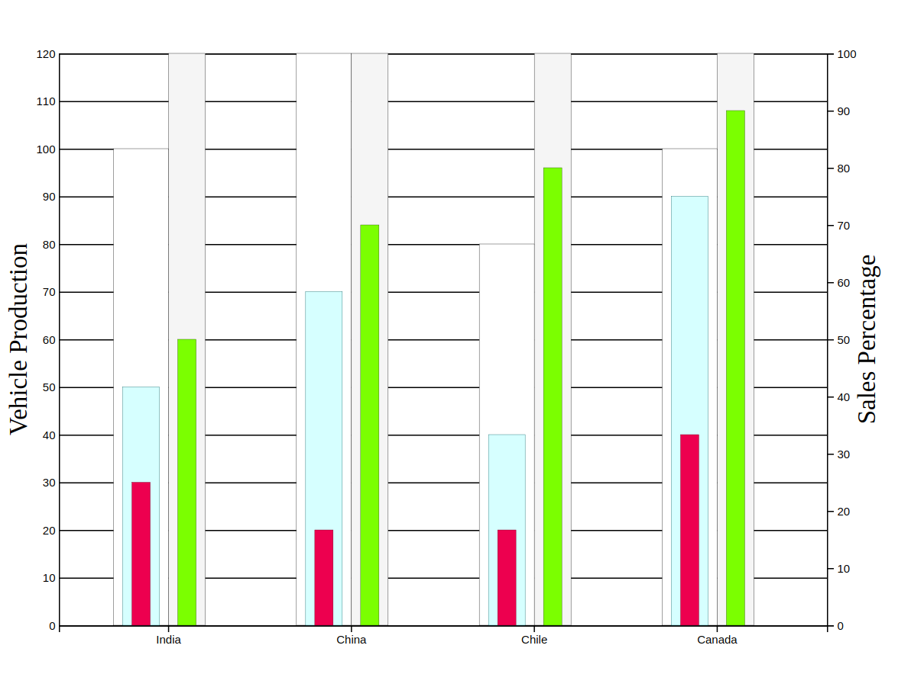

# Dual scale group d3 bar in bar chart

  

  This is a demo to create dual scale grouped Bar-in-bar chart.
  Bars on the left side of ticks are represented in integers, where as bars on the right represents in percentage.
  It can be modified as per one's needs.
  
# Dependencies

  D3
